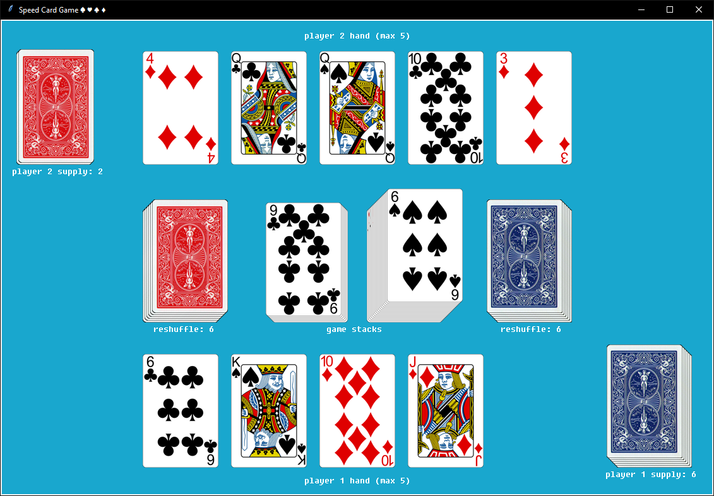

# Speed card game in Python 🐍

Easy to understand arcade card game, testing your quick reflexes :)

- Played with computer AI opponent (with adjustable latency)

### How to play:
- Choose (click) a card that is one higher or one lower in power than the cards in the center (gamestacks)
- Click on a gamestack to place the card on top of it
- If you can't place a card, click on the deck to draw a new one (only if you don't have more than 5 cards in your hand)
- The computer will also put cards on the gamestacks
- If neither of you can play a card, the gamestacks will be replaced with new cards from the reshfuffle pile (click on it reshuffle, when a message appears)
- The game ends when you or the computer can't play any more cards
- **The player that runs out of their cards first, wins**

### How to run:

Run the main.py file with Python 3.11 or higher.\
`python main.py`

Required packages:

- Pillow (9.4.0)

### Preview:
